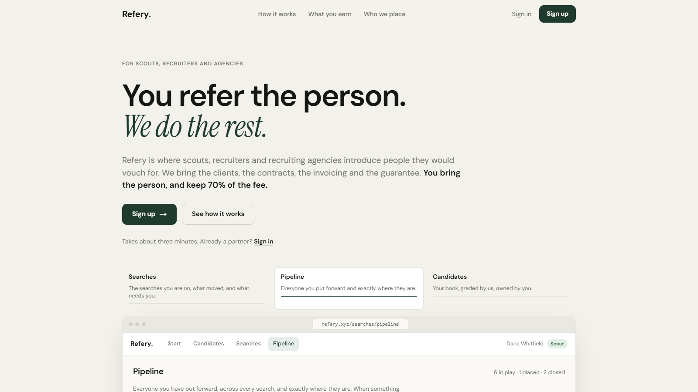

<h1 align="center">Refery</h1>

The recruiting partner network for VC-backed startups. This repo explains how it works. The code lives in private repos.

<a href="https://refery.io">refery.io</a> · <a href="https://refery.xyz">refery.xyz</a> · <a href="https://refery.xyz/guide">Partner guide</a> · <a href="CHANGELOG.md">Changelog</a>

## What it does

A founder shares a role. Refery proposes it to the partners most likely to know the right person. Partners put people forward, the desk grades them, the founder decides in one tap, and everyone sees exactly where each candidate is. When someone is hired, the fee is invoiced and the partner keeps 70%.

## How it is built

| Layer | Choice |
| --- | --- |
| App | Next.js 16 (App Router), React 19, Tailwind 4, installable PWA with web push |
| Data | Supabase Postgres, row-level security on every table, pg_cron for every scheduled job (20 of them) |
| Email | Resend, with inbound parsing so a CV emailed to us becomes a candidate |
| Ops | Slack: every decision is a reaction on a card, mirrored into the database with a human actor |
| AI | OpenAI embeddings and structured outputs for matching, grading and drafts. A person reads the evidence before anything sends |
| Agents | An MCP server with twelve verbs, so a Claude session can run the desk with the operator's key |
| Tests | Vitest. Every outbound email template has a render test, so a broken name can never ship |

## How it is made

One person, daily commits since April 2026. Design notes and proposals are dated and kept, so the reasoning behind each change is on record. The private repos hold 465 commits across the desk, the site, the pipeline and the automation worker.

## Status

Hundreds of scouts and recruiting partners use it every day. Not open source, not taking contributions. Questions: hello@refery.io.

## License

The text and images in this repository are licensed under [CC BY 4.0](LICENSE). The Refery name and mark are not.
